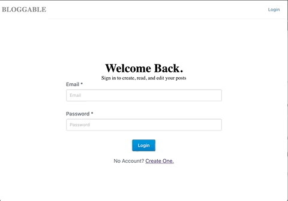

# MERN ASSESSMENT 

This is a simple application that allows writers to create an account and post/manage their own blog entries. Readers are able to search for posts to read and comment on, or to view profiles of writers.

## Demo 
Reader Example.                      |  Writer Example
:-----------------------------------:|:-----------------------------------:
 |  

## How was it built?

This project was created with [Create React App](https://github.com/facebook/create-react-app) and Express. 

The front end used [Evergreen UI](https://evergreen.segment.com)

### Set up
Once you clone and cd into this repo, in the project directory:

- `yarn install`
- `cd client && yarn install`

### Running the App 

- `yarn dev`
Runs the app in the development mode.\
Open [http://localhost:3000](http://localhost:3000) to view it in the browser.

### Testing/Demoing the App 

In order to seed the database with writers, posts, comments, run the following command in the root directory:

-`node server/db/seeds/index.js`

Each writer will have password of '12345678'. This can be adjusted in the seed file. 

### Dependencies

| BackEnd             | FrontEnd           |
| ------------------- | ------------------ |
| bcryptjs            | axios              |
| cloudinary          | evergreen-ui       | 
| dateformat          | react              |
| express             | react-dom          |
| express-fileupload  | react-router-dom   |
| faker               | react-scripts      |
| jsonwebtoken        | web-vitals         |
| mongoose            |     
| passport            |        
| passport-jwt        |
| validator           |

## In the Future

- Add Comment Counter
- Flesh out front end desgin 
- Add loaders 
- Add shadows to elevate cards 
- Deploy site
